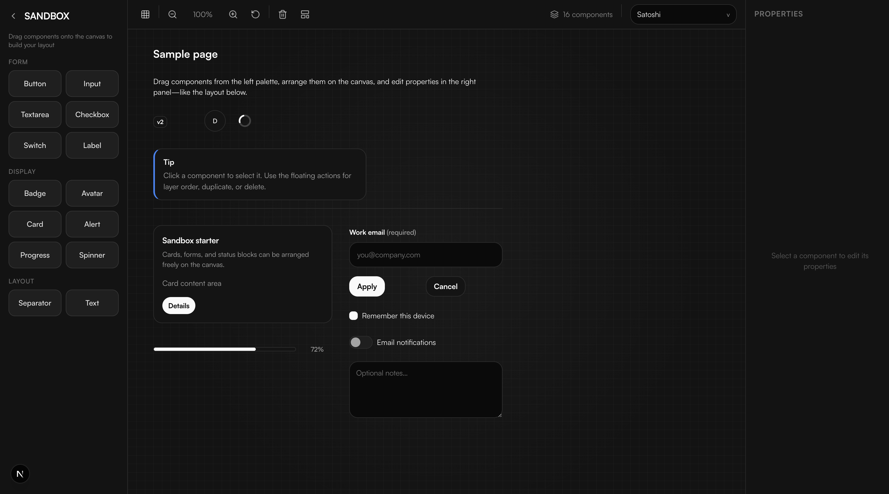

# Design System Playground



**Short description:** a small **Next.js** app to explore a monochrome component library, try variants in a **playground**, and compose screens on a **drag-and-drop sandbox** with live props—plus **Storybook** for isolated development and Chromatic-friendly visual checks.

It ships a **component explorer** (`/playground`), a **page-builder sandbox** (`/sandbox`) with persisted canvas state, and **dark / soft** theme presets. Docs generation and tests are available via npm scripts.

## Quality gate (Chromatic)

[](https://github.com/<your-username>/<your-repo>)

**Chromatic** hosts Storybook builds in the cloud and **compares UI screenshots** between the baseline and each branch or pull request. That gives you **visual regression testing**: unintended layout or styling changes show up as diffs in review instead of only being caught manually.

## Core features

### App routes

| Route | Description |
|-------|-------------|
| `/` | Landing page with links to the explorer and the sandbox. |
| `/playground` | **Component explorer**: sidebar catalog of primitives, per-component descriptions, static and interactive showcases (variants, sizes, states), font family control, and a shortcut to the sandbox. |
| `/sandbox` | **Page builder sandbox**: drag components from a palette onto a canvas, move and stack them, edit props in the right panel, grid snap, zoom, and Alt-drag to pan. Includes a **sample layout** on first visit (and after clearing empty storage) plus a toolbar action to **reload the sample**. Canvas state is persisted in **localStorage** (with merge logic so an empty saved list does not wipe the starter demo after hydration). |

### Theming and tooling

- **Theme presets** (CSS variables on the document root): **dark** (default) and **soft**—monochrome only.
- **Storybook** for isolated development, docs, and visual tests.
- **Zustand** for playground appearance (theme, font) and sandbox canvas state.
- Optional **TypeScript prop docs** via `npm run docs:generate`.

## Getting started

```bash
npm install
npm run docs:generate
npm run dev
```

- App: [http://localhost:3000](http://localhost:3000)
- Storybook: [http://localhost:6006](http://localhost:6006)

You can use **Bun** instead of npm if you prefer (`bun install`, `bun run dev`, etc.).

## Useful scripts

- `npm run dev` — Start the Next.js app.
- `npm run build` — Production build (includes TypeScript check).
- `npm run storybook` — Start Storybook locally.
- `npm run build-storybook` — Build Storybook static output.
- `npm run chromatic` — Publish Storybook to Chromatic (requires `CHROMATIC_PROJECT_TOKEN`).
- `npm run docs:generate` — Regenerate TypeScript-oriented component docs.
- `npm run lint && npm test && npm run build` — Typical local quality pass.

## Chromatic setup

1. Create a Chromatic project and obtain your project token.
2. Add a repository secret named `CHROMATIC_PROJECT_TOKEN`.
3. Push or open a pull request to trigger `.github/workflows/chromatic.yml`.

After setup, replace `<your-username>/<your-repo>` in the badge URL near the top of this file with your real GitHub path.
